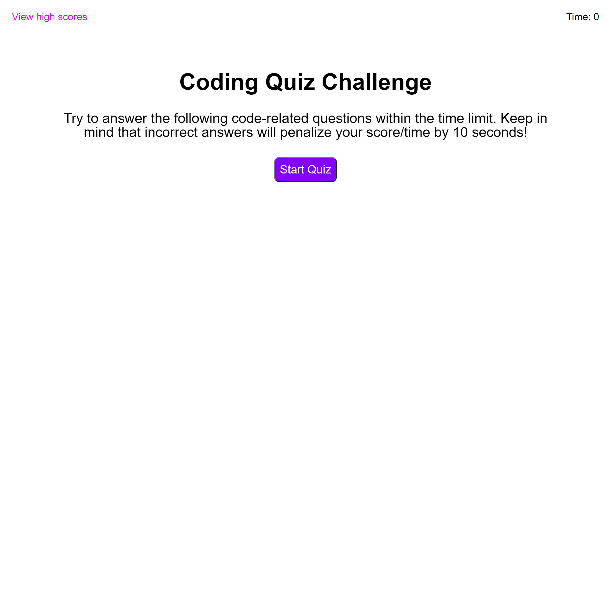
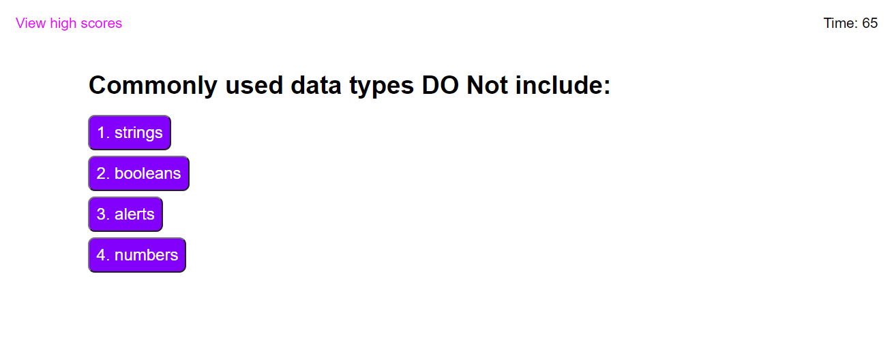
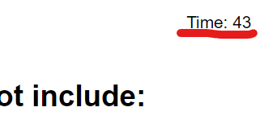
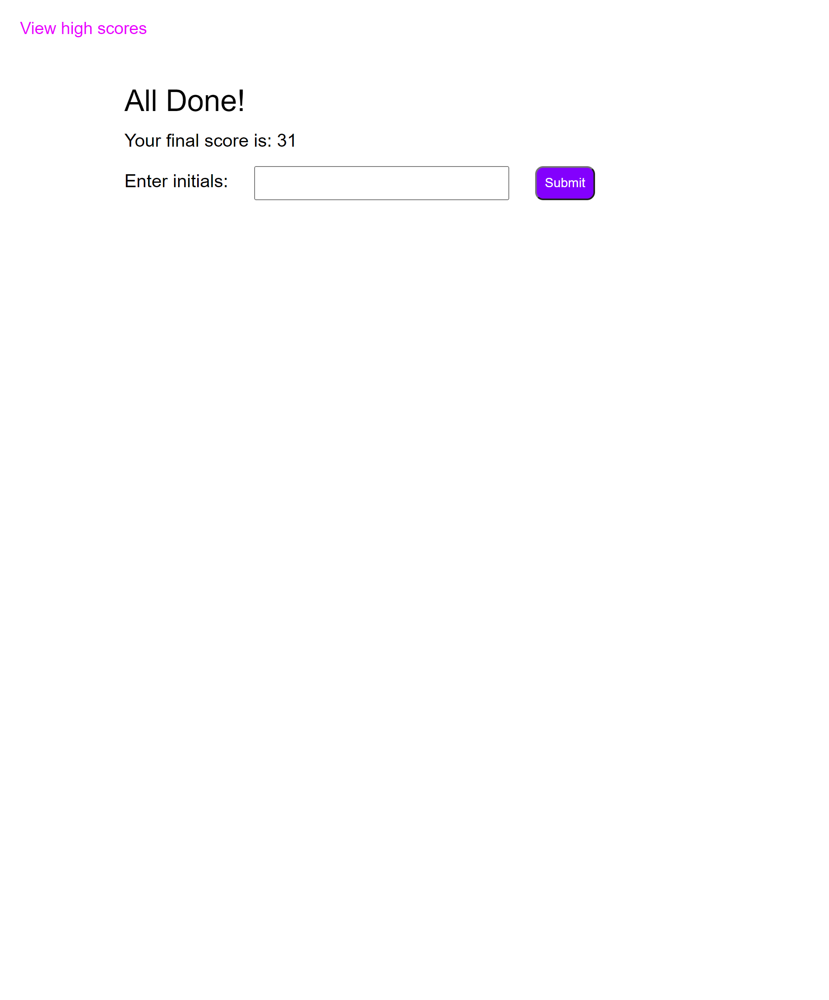
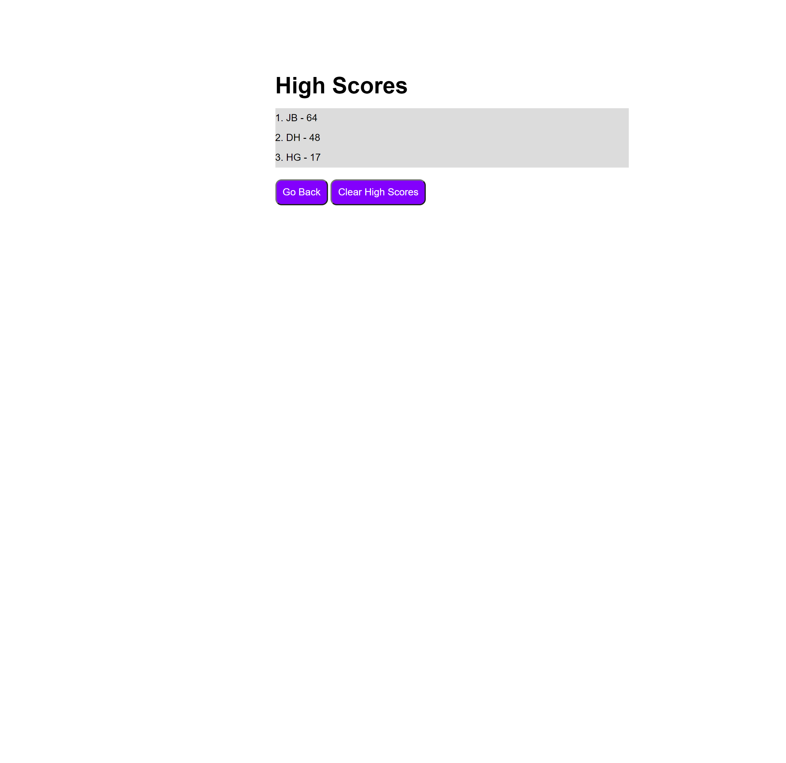
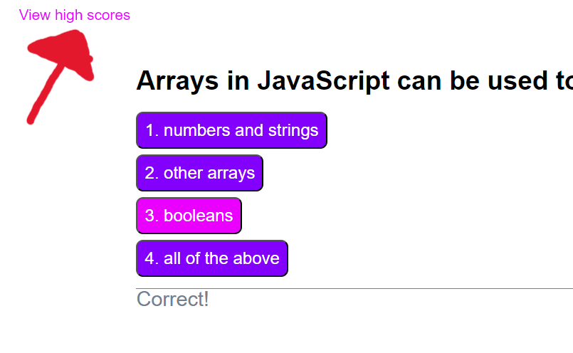

# Code Quiz

## About
While on my path to becoming a full-stack web developer, I wanted a way to start to prepare myself for the interview process. It is commonly requested during the process, for the coder being interviewed, to be tasked with some kind of coding assessment. Typically, this assessment is a combination of multiple choice questions/coding tasks. This application goes through a couple of foundational questions about coding and some of the languages, helping the user brush up on some basic coding facts. Throughout the process of building it, I became much more familiar with JavaScript and how it is typed. Since I had never before made an application with JavaScript.

## Table of Contents
- [Installation](#installation)
- [Usage](#usage)
- [Deployed-Application](#deployed-application)
## Installation
All that is required is a device with access to a web browser.
## Usage
Opening up the application will bring you here:
### 

Select the start button to begin, and the questions will be generated on the page:
### 

When the start button is pressed, the timer will begin, and you only have 75 seconds to answer all the questions.
### 

Each time an answer is selected. You will be notified whether that answer choice was correct or incorrect. Each time you answer a question incorrectly, the timer will go down by 10 seconds.

At the end, your score will be the time you have remainaing. Your score will be displayed and a text box below will appear asking for your initials.
### 

Enter your initials and you will be taken to the high score page, where you will see your recent entry, and any other previously stored scores.

You can press the <strong>GO BACK</strong> button to return to the start page. If you didn't like your score, or it is starting to get crowded, just press <strong>CLEAR HIGH SCORES</strong> and all previous score entries will be wiped.
### 

Clicking the text here will take you to the high score page at any point:
### 

## Deployed Application
**Live URL here: [_https://jebulger.github.io/code-quiz/_](https://jebulger.github.io/code-quiz/)**

### 